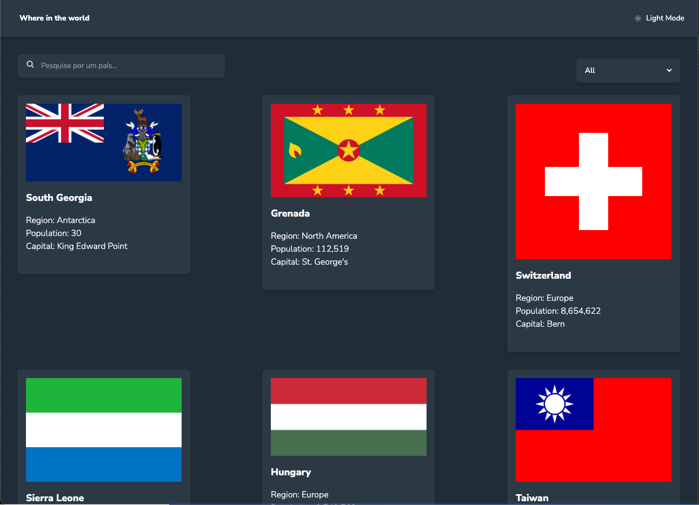
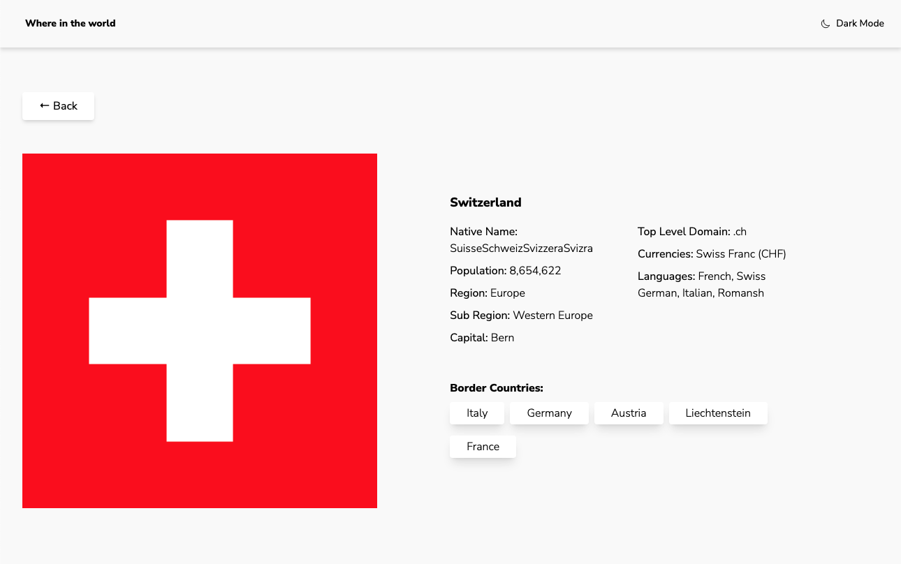
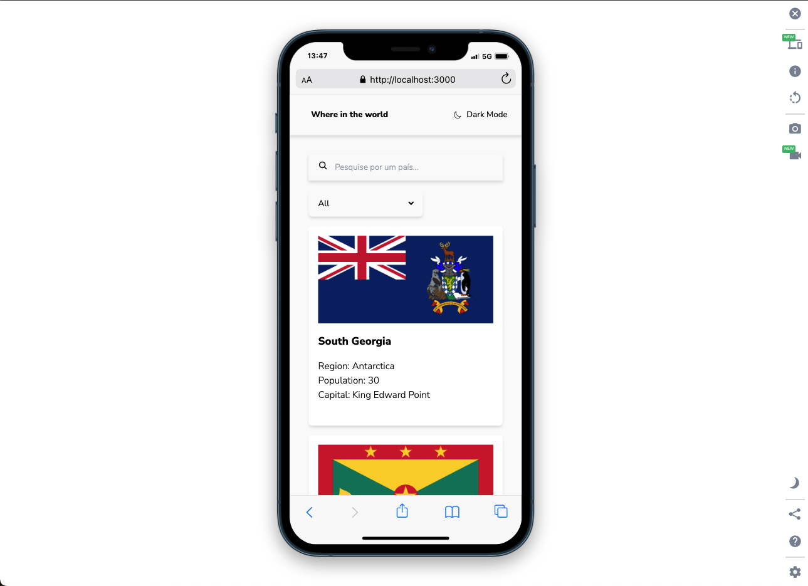
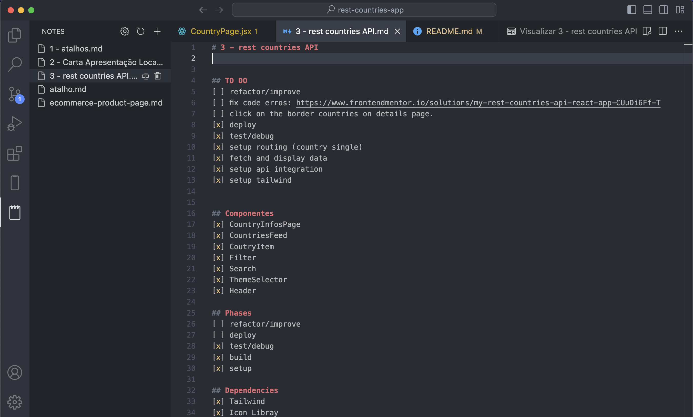

Here’s the README content formatted as a Markdown file:

# Frontend Mentor - REST Countries API Challenge

This is a solution to the [REST Countries API Challenge](https://www.frontendmentor.io/challenges/rest-countries-api-with-color-theme-switcher-5cacc469fec04111f7b848ca). This project demonstrates skills in building a responsive web application using React, including handling APIs, managing state, and implementing a theme switcher.

## Table of contents

- [Overview](#overview)
  - [The challenge](#the-challenge)
  - [Screenshot](#screenshot)
  - [Links](#links)
- [My process](#my-process)
  - [Built with](#built-with)
  - [What I learned](#what-i-learned)
  - [Continued development](#continued-development)
  - [Useful resources](#useful-resources)
- [Author](#author)
- [Acknowledgments](#acknowledgments)

## Overview

### The challenge

Users should be able to:

- See all countries from the API on the homepage
- Search for a country using an `input` field
- Filter countries by region
- Click on a country to see more detailed information on a separate page
- Click through to the border countries on the detail page _(I need to work on that)_
- Toggle the color scheme between light and dark mode

### Screenshot





This screenshot shows the homepage with a list of countries, the search and filter options, and an example of the detail page for a selected country.

### Links

- Solution URL: [Github](https://www.frontendmentor.io/solutions/rest-countries-api-solution-url)
- Live Site URL: [Netlify](https://my-rest-countries-app.netlify.app/)

## My process

- I show up on time.
- I do my prayers.
- I do the work.
- One thing at a time.
- Next day, I repeat.

The process is about showing up daily and doing the work, over and over again.

I also keep a .md file that I think the problem, keep to-dos organized. It's a VSCode extension that helps me to keep everything in it's place. 
#### Notes - VSCode Extension:




### Built with

- Semantic HTML5 markup
- CSS custom properties
- Flexbox
- Mobile-first workflow
- [React](https://reactjs.org/) - JS library
- [Tailwind CSS](https://tailwindcss.com/) - For styling
- [REST Countries API](https://restcountries.com/) - For fetching country data
- [React Router](https://reactrouter.com/) - For routing between pages

### What I'm really learning and training

The importance of sitting down and do my thing: study, code, repeat. 

*The programming thing?* I got hands-on experience with handling API requests, setting up a React routing system, and solving bugs. I ended up writing some spaghetti code, but you know what? It works!
The code isn't perfect, but today I'm better than yesterday.

**Handling API calls and managing state:**

```javascript
useEffect(() => {
  async function fetchCountry() {
    try {
      const response = await fetch(
        `https://restcountries.com/v3.1/name/${countryName}`
      )
      const data = await response.json()
      setCountry(data[0])
    } catch (error) {
      console.log("Error fetching country data:", error)
    }
  }
  fetchCountry()
}, [countryName])
```

**Implementing dark/light mode with Tailwind CSS:**

```javascript
<button onClick={toggleTheme} className="bg-white dark:bg-dark-blue">
  Toggle Theme
</button>
```

### Continued development

Keep doing my thing. Keep beating resistence.

### Useful resources

- [Tailwind CSS Documentation](https://tailwindcss.com/docs) - The official Tailwind CSS documentation was essential in quickly setting up and customizing the app's design.
- [React Router Documentation](https://reactrouter.com/docs) - Helped me understand how to manage navigation and routing between the country list and detail pages.

## Author

- Website - [Personal Website](https://www.frontendmentor.io/profile/aecio-neto)
- Frontend Mentor - [@yourusername](https://www.frontendmentor.io/profile/aecio-neto)
- GitHub - [@yourusername](https://github.com/aecio-neto)
- Linkedin - [@yourusername](https://www.Linkedin.com/in/aecio-neto)

## Acknowledgments

Huge thanks to [Steven Pressfield](https://stevenpressfield.com/) for writing _The War of Art_, which inspired me to push through resistance and keep creating, and to [Prof. Lúcia Helena](https://www.youtube.com/@NovaAcropole) for her philosophy teachings that continuously guide my thinking and approach to learning.

```